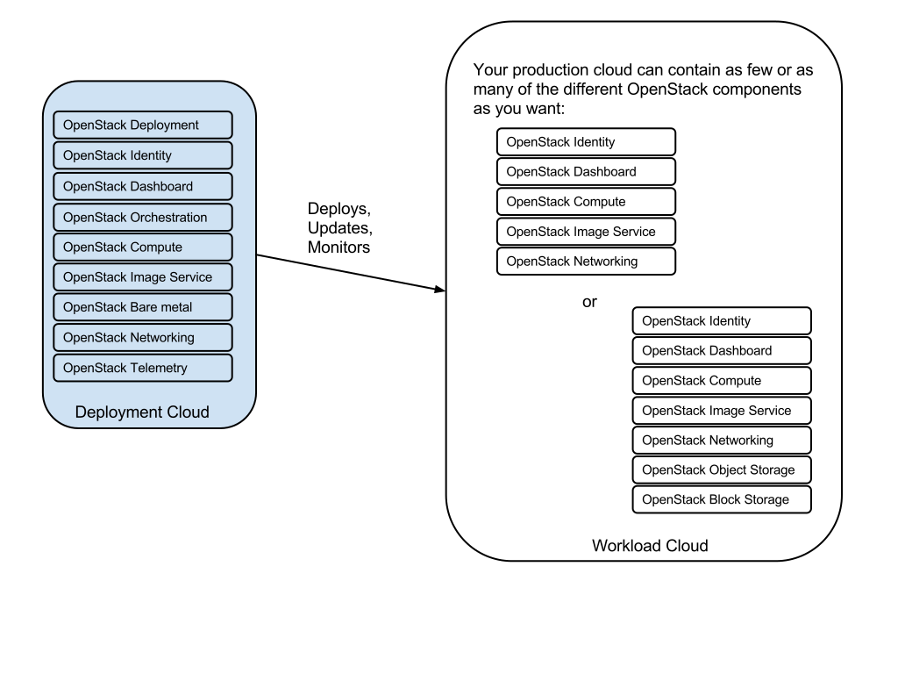
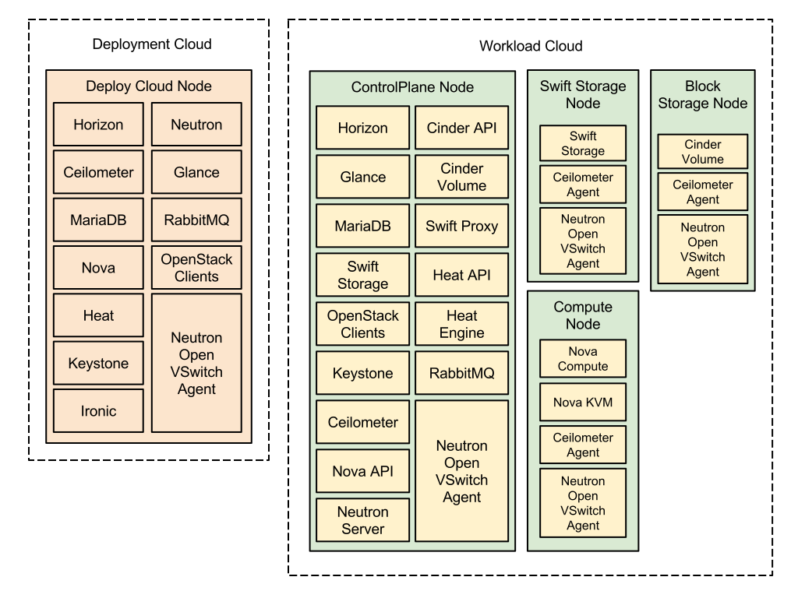

TripleO Architecture Overview
================================

TripleO is the friendly name for “OpenStack on OpenStack”.  It is an official OpenStack program with the goal of allowing you to deploy a production cloud onto bare metal hardware using a subset of existing OpenStack components.  Ultimately TripleO will provide a complete end-to-end infrastructure management solution for OpenStack business planning, system deployment and operations.

With TripleO, you start by creating a “Deployment cloud” (sometimes referred to as “undercloud”) that will contain the necessary OpenStack components to deploy and manage a “Workload cloud” (sometimes referred to as “overcloud”).  The Workload cloud is the deployed solution and can represent a cloud for any purpose (e.g. production, staging, test, etc).  The operator can choose any OpenStack components they want for the Workload cloud using the tools described in the rest of this document.

TripleO leverages several existing core components of OpenStack including Nova, Neutron, Heat, Glance and Ceilometer to deploy OpenStack on hardware.  Nova and Ironic are used in the Deployment cloud to manage bare metal instances that comprise the infrastructure for the Workload cloud.  Neutron is utilized to provide a networking environment in which to deploy the Workload cloud, machine images are stored in Glance and Ceilometer collects metrics about your Workload cloud.

The following diagram illustrates a physical view of how the Deployment cloud may be hosted on one physical server and the Workload cloud distributed across many physical servers.

Deployment Workflow Overview
-----------------------------

Using TripleO to deploy an OpenStack cloud consists of four phases:

1. **Preparation**

- Install Deployment cloud
- Create images to establish the Workload cloud
- Create a Heat template describing the Workload cloud containing references to your images

2. **Deployment**

- Use Heat to deploy your template
- Heat will use Nova to identify and reserve the appropriate nodes
- Nova will use Ironic to startup nodes and install the correct images

3. **Per-node setup**

- When each node of the Workload cloud starts it will gather its configuration metadata from Heat Templated configuration files on the node are updated with values from the metadata

4. **Workload cloud initialization**

- Services on nodes of the Workload cloud are registered with Keystone

Deployment Workflow Detail
----------------------------

1. **Preparation**

The first step is to install the Deployment cloud. There are multiple ways this can be done, for example by following either the developer-based steps known as `devtest <http://docs.openstack.org/developer/tripleo-incubator/devtest.html>`_ or if you are running RDO you can run the `Instack <http://openstack.redhat.com/Deploying_RDO_using_Instack>`_ tools. This document will not focus on the individual steps needed to install the Deployment cloud but rather point out that it uses the tripleo-incubator repository which contains, among other things, scripts that will install needed dependencies.

Before deploying the Workload cloud, you must first build images which will be installed on each of the nodes of the Workload cloud.  TripleO uses `diskimage-builder <https://github.com/openstack/diskimage-builder>`_ for building these so called “`Golden Images <http://blog-slagle.rhcloud.com/?p=182>`_”. The diskimage-builder tool takes a base image e.g. `fedora <http://download.fedoraproject.org/pub/fedora/linux/updates/20/Images/x86_64/Fedora-x86_64-20-20140407-sda.qcow2>`_ or `ubuntu <http://cloud-images.ubuntu.com/trusty/current/trusty-server-cloudimg-amd64-root.tar.gz>`_, and then layers additional software, called “elements”, on top of that. The final result is a qcow2 formatted image with software installed but not configured. For example, to build an image which when configured would be able to run the Nova compute service, you would do the following:

::

    disk-image-create -a amd64 -o compute-image fedora \
        nova-compute nova-kvm [other elements]

While the diskimage-builder repository provides operating-system specific elements, ones specific to OpenStack, e.g. nova-api, are found in `tripleo-image-elements <https://github.com/openstack/tripleo-image-elements>`_.  You can add different elements to an image to provide specific applications and services.   Once all the images required to deploy the Workload cloud are built, they are stored in Glance running on the Deployment cloud.

Once the images needed for the Workload cloud have been created and the Deployment cloud installed, the next step is construct a deployment plan to describe what you want the Workload cloud to look like e.g. what OpenStack services should be deployed on how many nodes.  You will also register the hardware available to deploy the Workload cloud to.

TripleO uses `Heat <http://docs.openstack.org/developer/heat/>`_ running on the Deployment cloud to orchestrate the actual deployment of the Workload cloud, so constructing a deployment plan consists of creating a Heat template. Heat provides template based orchestration for describing an application by executing appropriate OpenStack API calls to generate a running application.  Heat integrates core components of OpenStack into a one-file template system. The templates allow creation of most OpenStack resource types (such as instances, floating ips, volumes, security groups, users, etc), as well as some more advanced functionality such as instance high availability, instance autoscaling, and nested stacks.

TripleO maintains a library of Heat templates in `tripleo-heat-templates <https://github.com/openstack/tripleo-heat-templates>`_.  This library also contains a script to merge combinations of templates to create a single Heat template file.

2. **Deployment**

Deployment to physical servers happens through a collaboration of Heat, Nova, Neutron, Glance and Ironic. To deploy the Workload cloud a call is made to the Heat API to create a stack using the Heat client cli e.g.

::

    heat stack-create workload-cloud -f workload-heat-template.yml

For each node in the Workload cloud, the Heat engine asks Nova-API to create an instance using the appropriate image as specified in the Heat template and then Nova-Scheduler selects a machine to deploy to.  Nova-Compute then uses the `Ironic Service <http://docs.openstack.org/developer/ironic/deploy/user-guide.html>`_ as a bare metal hypervisor to deploy that image to the selected machine.  The Ironic service uses PXE and IPMI to complete the deployment of the image. See Ironic’s “`Understanding Baremetal Deployment <http://docs-draft.openstack.org/04/94604/7/check/gate-ironic-docs/06f28b4/doc/build/html/deploy/user-guide.html#understanding-bare-metal-deployment>`_” for further details.

3. **Per-node setup**

When a Workload node boots up, it runs `os-collect-config <https://github.com/openstack/os-collect-config/blob/master/README.rst>`_.  The os-collect-config script saves data from the Heat metadata API locally and then calls `os-refresh-config <https://github.com/openstack/os-refresh-config>`_ any time that metadata has changed.  Here is a simple example of some json-based metadata:

::

    {"mysql": {"root-password": “Heifs23jk3”}}

The images created by diskimage-builder using tripleo-image-elements contain directories of scripts and templated files based on the “elements” . When os-refresh-config runs it will execute those scripts and then call `os-apply-config <https://github.com/openstack/os-apply-config/blob/master/README.rst>`_ to combine the configuration files with the latest metadata.  The templated files are stored within elements in a directory structure that mimics the root file structure.

::

    ~/elements/mysql$ tree
    .
    └── etc
        └── mysql
            └── mysql.conf

By default, os-apply-config will read config files according to the contents of the file /var/lib/os-collect-config/os_config_files.json.  Here is a simple example from the mysql-common element:

::

    [client]
    user = root
    {{#mysql.root-password}}
    password = {{.}}
    {{/mysql.root-password}}

Using the metadata example from above:

::

    {"mysql": {"root-password": “Heifs23jk3”}}

The call to os-apply-config would update the template with the value(s) in the metadata and the resulting file would look like:

::

    [client]
    user = root
    password = “Heifs23jk3”

After the configuration files are updated, os-refresh-config runs the post-configure.d phase and starts or restarts services to apply the new configuration.

4. **Workload cloud initialization**

After the Workload cloud has been deployed, the initialization of OpenStack services (e.g Keystone, Neutron, etc) needs to occur. That is accomplished today by scripts in the `tripleo-incubator <https://github.com/openstack/tripleo-incubator>`_ source repository.   In the near future, the cloud initialization tasks will be handled by `os-cloud-config <https://github.com/openstack/os-cloud-config>`_ which contains common code, the seed initialisation logic, and the post heat completion initial configuration of a cloud.  There are three primary steps to completing the initialization:

- Initializing Identity Services (Keystone)
- Registering service endpoints (e.g. Glance, Nova)
- Specify a block of IP addresses for Workload cloud instances (Neutron)

The first step initializes Keystone for use with normal authentication by creating the admin and service tenants, the admin and Member roles, the admin user, configure certificates and finally registers the initial identity endpoint.  The next step registers image, orchestration, network and compute services running on the default ports on the controlplane node.  Finally, Neutron is given a starting IP address, ending IP address, and a CIDR notation to represent the subnet for the block of floating IP addresses that will be used within the Workload cloud.

Managing the deployment
-------------------------

After the Workload cloud deployment is completed, it will be possible to scale it out or perform basic maintenance operations via Tuskar, but currently the TripleO upstream community is still working on those features.
